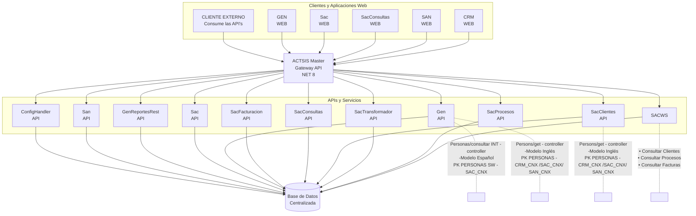

### Paso 1: Creación del Sitio para el Gateway

1. **Copia de la Carpeta**:
	- Copie la carpeta Gateway enviada en el despliegue dentro del servidor.
2. **Creación del Grupo de Aplicación**:
	- Cree un grupo de aplicaciones para Gateway, sugiriendo el nombre **`ActsisGateway`**, siguiendo los mismos pasos utilizados para las aplicaciones anteriores.

3. **Creación del Sitio**:
	- Cree un nuevo sitio con las mismas especificaciones que `GenReportesWS`, estableciendo la ruta de acceso física a la carpeta copiada de Gateway.

:::info

Endpoint de prueba **https://gateway.com/time/api/time/current/zone?timeZone=America%2FBogota**.

:::

### Paso 2: Creación del Sitio para el **ConfigHandler**
1. **Copia de la Carpeta**:
	- Copie la carpeta `ConfigHandler` enviada en el despliegue dentro del servidor.
2. **Creación del Grupo de Aplicación**:
	- Cree un grupo de aplicaciones para Gateway, sugiriendo el nombre **ActsisConfigHandler**, siguiendo los mismos pasos utilizados para las aplicaciones anteriores.

3. **Creación del Sitio**:
	- Cree un nuevo sitio con las mismas especificaciones que **`GenReportesWS`**, estableciendo la ruta de acceso física a la carpeta copiada de **ConfigHandler**.

:::info

Endpoint de prueba **https://config.com/config/api/config**.

:::

### Paso 3: Actualización del Sitio de la Aplicación
1. **Identificación de Carpetas**:
	- Una vez actualizado el sitio de la aplicación SACNET, identifique 7 nuevas carpetas en el sitio llamadas **Sac**.

2. **Creación de Grupos de Aplicación**:
	- Se sugiera un nombre que identifique claramente a qué sistema y módulo pertenece, por ejemplo, la carpeta `ProcesosApi` debería ser llamada **SACProcesosApi**.
> [!information]
> La versión de .NET CLR es v4

- Repítelo los mismos pasos para las demás aplicaciones `SACProcesosWeb`, `SACRedesApi`, `SACRedesWeb`, `SACRevisionesApi`, `SACRevisionesWeb`, `SACApi`.
- Asignar el mismo usuario de Identidad del grupo de aplicación del sistema.

3. **Conversión a Aplicaciones Web**:
	- Las carpetas deben convertirse en aplicaciones web con un grupo de aplicación independiente creadas en el paso anterior.

